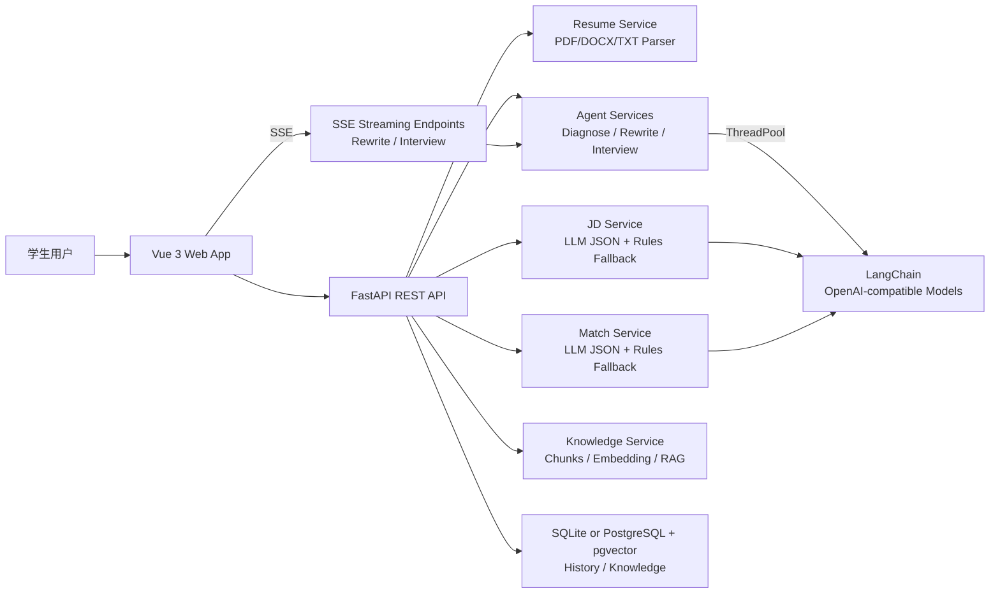

# Interview AI Agent

**AI-powered resume diagnosis, JD matching, and interview preparation for university students.**

面向大学生求职场景的 AI 简历诊断、JD 匹配分析与面试准备系统。

[](https://fastapi.tiangolo.com/)
[](https://vuejs.org/)
[](https://www.langchain.com/)
[](https://github.com/pgvector/pgvector)
[](https://playwright.dev/)
[](https://docs.docker.com/compose/)
[](LICENSE)

---

## Table of Contents

- [Project Overview](#项目定位)
- [Highlights](#项目亮点)
- [Documentation](#文档导航)
- [Demo Flow](#在线演示流程)
- [Core Features](#核心功能)
- [Tech Stack](#技术栈)
- [Architecture](#架构概览)
- [Project Structure](#项目结构)
- [Quick Start](#快速开始)
- [Model Configuration](#模型配置)
- [API Reference](#api-摘要)
- [Quality Checks](#本地质量检查)
- [Agent Evaluation](#agent-质量评测)
- [Interview Talking Points](#面试展示亮点)
- [Roadmap](#路线图)

---

## 项目定位

Interview AI Agent 解决学生在简历撰写、岗位匹配和面试准备中反馈慢、表达不专业、准备不系统的问题。系统支持上传 PDF / DOCX / TXT 简历，粘贴目标岗位 JD，并从 HR 初筛、技术面试官、简历编辑专家等视角生成诊断建议、匹配评分、简历改写和面试问题。

这个仓库适合作为简历投递、面试讲解和开源浏览项目：它覆盖了前后端分离、文件解析、LLM 接入、结构化 Schema、历史记录、pgvector RAG、检索评测、Docker Compose 一键启动、E2E 测试和工程化文档。

## 项目亮点 / Highlights

| 亮点 | 说明 |
| --- | --- |
| Agent 化诊断 | 从 HR 初筛、技术面试官、简历编辑专家三个视角协同分析，并输出证据链、项目深挖和岗位族画像；三视角并行执行，延迟降低 30%+ |
| 流式输出 | 简历改写和面试自我介绍支持 SSE 流式生成，用户可实时看到内容逐字输出，体验更流畅 |
| LLM 工程化 | 基于 LangChain 封装 OpenAI-compatible 调用，支持 DeepSeek、Gemini、GPT、Qwen、GLM 等模型预设 |
| 稳定兜底 | JD、匹配、诊断等核心链路均保留规则兜底，没有 API Key 也能本地演示 |
| RAG 增强 | 支持知识库上传、语义 chunk、Embedding、pgvector/SQLite 双路径、hybrid retrieval、rerank 和 citation 展示 |
| 可观测性 | 后端输出结构化 JSON 日志，并提供健康检查、就绪检查和 LLM/RAG 调用统计 |
| 工程质量 | 内置 Agent 评测、RAG 命中率评测、后端静态检查、前端构建和 Docker Compose 本地部署 |

### What it does (30-second overview)

```
Upload Resume (PDF/DOCX/TXT)
    → Parse & Structure (education, projects, skills, experience)
    → Paste Target Job Description (JD)
    → AI Matching Score (tech stack / project / education / experience)
    → Multi-perspective Diagnosis (HR / Tech Interviewer / Resume Editor)
    → Resume Rewrite (multiple modes) + Interview Prep (self-intro, project deep-dive)
    → All results saved to history, knowledge base RAG for context injection
```

## 文档导航

| 文档 | 用途 |
| --- | --- |
| [Architecture](docs/ARCHITECTURE.md) | 系统架构、后端分层、LLM/RAG 调用链路 |
| [API Reference](docs/API.md) | 主要 REST API、请求结构和返回字段 |
| [RAG Quality](docs/RAG_QUALITY.md) | 检索质量优化、chunk、rerank、评测指标和引用来源 |
| [Interview Notes](docs/INTERVIEW_NOTES.md) | 面试讲解路线、简历项目描述和亮点话术 |
| [Roadmap](docs/ROADMAP.md) | 已完成能力和后续演进方向 |

## 在线演示流程

本地启动后访问 `http://localhost:5173`：

1. 在「简历分析」上传简历文件。
2. 点击「解析简历」查看结构化结果。
3. 粘贴目标岗位 JD，点击「分析 JD」。
4. 点击「开始匹配分析」查看评分、关键词覆盖和优化建议。
5. 进入「简历改写」或「面试准备」生成后续材料。
6. 在「设置」查看模型配置并测试模型连接。

## 核心功能

| 模块 | 能力 |
| --- | --- |
| 简历上传与解析 | 支持 PDF、DOCX、TXT，提取原始文本并结构化为教育、项目、技能、实习、获奖等字段 |
| JD 分析 | 优先使用 LLM JSON 输出，提取岗位名称、类型、技能、职责、要求和岗位摘要，失败时规则兜底 |
| 匹配度评分 | 从技术栈、项目经历、教育背景、经验匹配四个维度评分，生成匹配/缺失关键词和修改建议 |
| 多视角诊断 | 从 HR 初筛、技术面试官、简历编辑专家视角给出简历反馈，三视角并行执行 |
| 简历改写 | 支持大厂实习、后端开发、AI 应用开发、项目强化、HR 友好、一页版等模式，支持 SSE 流式输出 |
| 面试准备 | 生成项目深挖、技术八股、场景设计、项目难点、HR 综合、自我介绍建议，自我介绍支持流式生成 |
| 历史记录 | 保存每次分析结果，支持查看、恢复和删除 |
| 知识库 RAG | 支持资料上传、文档切分、Embedding 和 pgvector 检索，并注入 Agent 诊断上下文 |
| 模型管理 | 默认 DeepSeek V4 Pro，支持切换 DeepSeek Flash、Gemini、GPT、Qwen、GLM 等 OpenAI-compatible 模型 |
| E2E 测试 | Playwright 覆盖真实浏览器上传、解析、JD 分析和匹配分析流程 |

## 技术栈

### Frontend

- Vue 3 + TypeScript
- Vite
- Pinia
- Vue Router
- Axios
- Element Plus
- Markdown 渲染组件
- Playwright E2E

### Backend

- Python 3.11+
- FastAPI + Uvicorn
- Pydantic
- SQLAlchemy
- SQLite / PostgreSQL + pgvector
- PyMuPDF / python-docx
- LangChain + OpenAI-compatible API
- RAG / Embedding / pgvector 向量检索

## 架构概览



更多说明见 [docs/ARCHITECTURE.md](docs/ARCHITECTURE.md) 和 [docs/API.md](docs/API.md)。

## 项目结构

```text
.
├── backend/
│   ├── app/
│   │   ├── core/          # 配置、模型预设
│   │   ├── routers/       # REST API 路由（含 SSE 流式端点）
│   │   ├── services/      # 业务服务层
│   │   ├── schemas/       # Pydantic Schema
│   │   ├── models/        # SQLAlchemy 模型
│   │   ├── prompts/       # LLM Prompt 模板
│   │   └── utils/         # 文件解析、JSON 清洗、SSE 格式化、文档处理
│   ├── requirements.txt
│   └── .env.example
├── frontend/
│   ├── src/
│   │   ├── views/
│   │   ├── components/
│   │   ├── api/           # Axios + fetch SSE 流式客户端
│   │   ├── stores/
│   │   └── router/
│   ├── tests/e2e/
│   └── package.json
├── docs/
├── docker-compose.yml
└── README.md
```

## 快速开始 / Quick Start

> **One command to run everything** — frontend, backend, and database.

### 方式 A：Docker Compose 一键启动（推荐）

推荐用于完整本地体验，会同时启动 `frontend + backend + postgres/pgvector`：

```bash
copy backend\.env.example backend\.env
docker compose up --build
```

启动完成后访问：

- Web 应用：`http://localhost:8080`
- 后端接口文档：`http://localhost:8000/docs`
- 健康检查：`http://localhost:8000/api/health/check`
- 就绪检查：`http://localhost:8000/api/health/ready`
- 调用观测快照：`http://localhost:8000/api/health/observability`

默认 `LLM_ENABLE_REMOTE=false`、`EMBEDDING_ENABLE_REMOTE=false`，即使没有 API Key 也能使用规则兜底和本地 hash embedding 完成基础链路。需要真实模型和 embedding 时，在命令前配置对应环境变量：

```bash
$env:LLM_ENABLE_REMOTE="true"
$env:LLM_MODEL_PRESET="deepseek-v4-pro"
$env:DEEPSEEK_API_KEY="your_deepseek_key"
$env:EMBEDDING_ENABLE_REMOTE="true"
$env:EMBEDDING_API_KEY="your_embedding_key"
docker compose up --build
```

知识库种子数据会在后端容器启动时自动导入，可通过 `SEED_KNOWLEDGE_ON_START=false` 关闭。

### 方式 B：本地开发启动

### 1. 后端

需要 Python 3.11+。本项目在 conda 环境 `interview-agent`（Python 3.11.16）上验证。

```bash
cd backend

# 方式一：使用已就绪的 conda 环境
conda activate interview-agent

# 方式二：从零建立虚拟环境
# python -m venv .venv
# .venv\Scripts\activate        # Windows
# source .venv/bin/activate     # macOS / Linux

# requirements.txt 是运行时依赖的唯一来源；requirements-dev.txt 在其之上
# 追加 ruff / pytest / httpx 等开发依赖，两者均已 pin 版本
pip install -r requirements-dev.txt

copy .env.example .env
python init_db.py
python run.py
```

后端默认运行在 `http://localhost:8000`，接口文档在 `http://localhost:8000/docs`。

### 2. 前端

```bash
cd frontend
npm install
copy .env.example .env
npm run dev
```

前端默认运行在 `http://localhost:5173`。

## 模型配置

默认预设为 `deepseek-v4-pro`：

```env
LLM_MODEL_PRESET=deepseek-v4-pro
DEEPSEEK_API_KEY=your_deepseek_key
```

可切换预设：

```env
LLM_MODEL_PRESET=deepseek-v4-flash
LLM_MODEL_PRESET=gemini-3.0-pro
LLM_MODEL_PRESET=gpt-5.5
LLM_MODEL_PRESET=qwen3.6-plus
LLM_MODEL_PRESET=glm-5.1
```

如果未配置 Key，或模型调用失败，系统会自动降级到规则分析逻辑，保证基础功能可用。设置页提供模型状态和连通性测试。

## API 摘要

| Endpoint | Method | Description |
| --- | --- | --- |
| `/api/health/check` | GET | 服务健康检查 |
| `/api/health/ready` | GET | 数据库、pgvector、LLM/RAG 状态就绪检查 |
| `/api/health/observability` | GET | LLM/RAG 调用统计与失败状态快照 |
| `/api/health/llm-config` | GET | 查看当前模型配置 |
| `/api/health/llm-models` | GET | 查看可选模型预设 |
| `/api/health/llm-test` | GET | 实际调用模型做连通性测试 |
| `/api/resume/upload` | POST | 上传简历文件 |
| `/api/resume/parse` | POST | 提取简历文本 |
| `/api/resume/structure` | POST | 简历结构化 |
| `/api/jd/analyze` | POST | JD 分析 |
| `/api/match/analyze` | POST | 简历与 JD 匹配度分析 |
| `/api/agent/diagnose` | POST | 多视角简历诊断（三视角并行） |
| `/api/resume/rewrite` | POST | 简历改写 |
| `/api/resume/rewrite/stream` | POST | 简历改写（SSE 流式输出） |
| `/api/interview/questions` | POST | 面试问题生成 |
| `/api/interview/questions/stream` | POST | 面试问题生成（SSE 流式自我介绍） |
| `/api/history/list` | GET | 历史记录列表 |
| `/api/knowledge/upload` | POST | 上传知识库资料 |
| `/api/knowledge/search` | POST | 检索知识库片段 |

完整接口说明见 [docs/API.md](docs/API.md)。

## 本地质量检查

```bash
cd backend
pip install -r requirements-dev.txt        # 首次：安装 ruff / pytest / httpx
python -m ruff check .                     # 规则集与忽略项见 backend/pyproject.toml
python -m compileall app
python tests/evaluation/run_agent_eval.py
python tests/evaluation/run_rag_eval.py

cd ../frontend
npm run build
npx playwright install                      # 首次：E2E 需要浏览器内核
npm run test:e2e
```

- `ruff` 的规则集与忽略项在 `backend/pyproject.toml` 中显式声明，不依赖 ruff 版本的默认值；
  `ruff check .` 覆盖 `app/`、`tests/`、`init_db.py` 和 `run.py`，当前为零告警。
- 依赖版本已 pin 在 `requirements.txt` 与 `requirements-dev.txt`，本地开发与 Docker 构建一致。
- E2E 测试会启动专用后端端口 `8001`，并设置 `LLM_ENABLE_REMOTE=false`，不会消耗真实模型额度。

## Agent 质量评测

项目内置离线评测集，用于验证 Agent 的工程化稳定性。评测会强制关闭远程 LLM 调用，覆盖规则兜底路径，因此无需 API Key 即可在本地或 CI 中运行。

```bash
cd backend
python tests/evaluation/run_agent_eval.py --write-report
```

当前评测结果：**5/5 passed，100% pass rate**。

| Case | 覆盖场景 | 识别岗位族 | 评分 | 结果 |
| --- | --- | --- | ---: | --- |
| `ai_application_strong` | AI 应用开发项目匹配 | `ai_application` | 76 | PASS |
| `backend_missing_metrics` | 后端项目缺少量化结果 | `java_backend` | 74 | PASS |
| `frontend_project` | 前端开发项目匹配 | `frontend` | 74 | PASS |
| `algorithm_weak_evidence` | 算法岗位证据不足 | `algorithm` | 58 | PASS |
| `product_ops` | 产品/运营方向 | `product_ops` | 67 | PASS |

评测维度包括：岗位族识别、多视角诊断、证据链输出、项目深挖、评分区间约束、关键词与短板覆盖。最新报告见 [latest.md](backend/tests/evaluation/reports/latest.md)，完整 JSON 见 [latest.json](backend/tests/evaluation/reports/latest.json)。

### RAG 检索质量评测

RAG 评测会构建临时知识库，验证 hybrid retrieval 的命中率、排序质量和引用来源展示：

```bash
cd backend
python tests/evaluation/run_rag_eval.py --write-report
```

输出指标包括 `Hit@1`、`Hit@K`、`MRR` 和 top citation。最新报告见 [rag_latest.md](backend/tests/evaluation/reports/rag_latest.md)，完整 JSON 见 [rag_latest.json](backend/tests/evaluation/reports/rag_latest.json)。

## 面试展示亮点

- 前后端分离：Vue 3 + FastAPI，接口统一响应格式。
- LLM 工程化：模型调用集中封装，支持多模型预设、连通性测试、失败兜底。
- 结构化建模：Resume / JD / Match / History / Knowledge 均使用 Pydantic Schema。
- 真实业务链路：上传文件、解析文本、分析 JD、评分、诊断、改写、面试准备闭环。
- 可扩展 RAG：知识库上传、切分、Embedding、pgvector 检索和 Agent 上下文注入已打通。
- Agent 可评测：内置离线样例集和报告生成脚本，验证岗位画像、项目深挖、证据链和兜底稳定性。
- 质量保障：后端 Ruff + 编译检查，Agent Evaluation，前端 TypeScript 构建，Playwright E2E。

## 路线图 / Roadmap

见 [docs/ROADMAP.md](docs/ROADMAP.md)。

## Contributing

Issues and pull requests are welcome. For major changes, please open an issue first to discuss what you would like to change.

1. Fork the repository
2. Create your feature branch (`git checkout -b feature/amazing-feature`)
3. Commit your changes (`git commit -m 'Add amazing feature'`)
4. Push to the branch (`git push origin feature/amazing-feature`)
5. Open a Pull Request

## License

[MIT](LICENSE)
