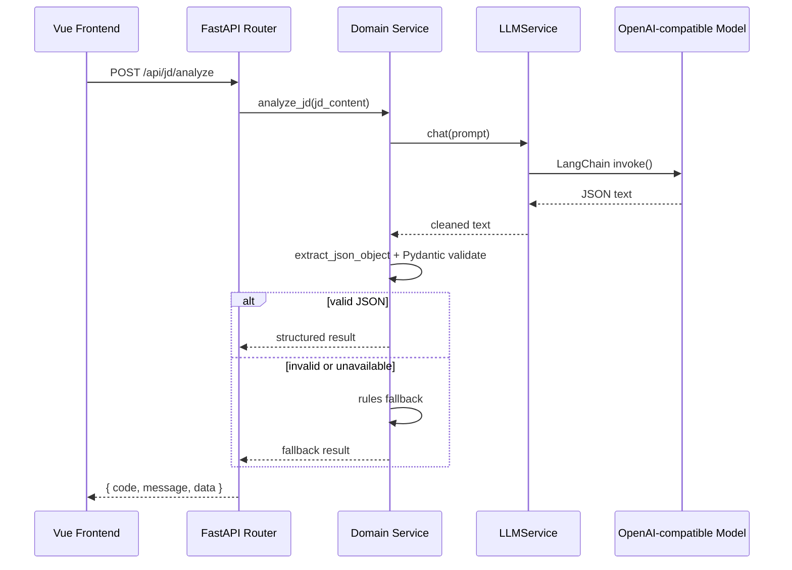
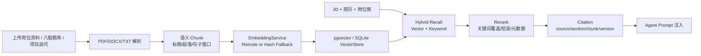

# Architecture

## 设计目标

Interview AI Agent 采用前后端分离架构，目标是让大学生在一个连续流程中完成简历解析、岗位理解、匹配分析、简历改写和面试准备。

系统设计重点：

- API 层与业务逻辑分离，便于测试和后续扩展。
- LLM 调用集中封装，避免模型供应商耦合到业务代码。
- Schema 先行，方便数据库存储、版本对比、RAG 检索和前端类型对接。
- 本地规则兜底，保证没有模型 Key 时也可以演示基础功能。
- RAG 链路可观测、可评测，支持从命中率和引用来源角度持续优化质量。

## 后端分层

```text
app/
├── main.py
├── core/
│   ├── config.py          # 环境变量配置
│   └── model_presets.py   # 多模型预设
├── routers/               # FastAPI 路由
├── services/              # 业务逻辑
├── schemas/               # Pydantic 请求/响应模型
├── models/                # SQLAlchemy 数据模型
├── prompts/               # Prompt 模板
└── utils/                 # 文件解析、JSON 清洗、文档切分
```

## 并发模型

FastAPI 中 `async def` 端点运行在事件循环上，`def` 端点由 anyio 线程池接管。本项目的业务链路是**同步**的——LangChain 的 `invoke()` / `stream()`、SQLAlchemy 同步 Session、PyMuPDF 解析都是阻塞调用。因此除以下两类端点外，所有端点一律声明为 `def`，避免阻塞事件循环：

- **SSE 流式端点**（`/api/resume/rewrite/stream`、`/api/interview/questions/stream`）：保持 `async def`，其同步生成器由 Starlette 通过 `iterate_in_threadpool` 迭代。
- **`/api/health/check`**：纯内存存活探针，刻意留在事件循环上，保证线程池被占满时依然能立即响应。

其余 25 个 API 端点均为 `def`。线程池上限默认为 **40**（anyio `CapacityLimiter(40)`），即单实例最多 40 个并发阻塞请求。

实测对照（4 个并发请求，每个端点固定耗时 1s，单 worker 单事件循环）：

| 端点声明 | 4 个并发请求总耗时 | 负载期间 `/api/health/check` |
| --- | ---: | ---: |
| `async def`（阻塞事件循环） | 4.04s（串行） | 3.62s |
| `def`（线程池，当前实现） | 1.16s | 0.02s |

已知边界：

- SSE 与普通端点**共用同一个 40 线程池**，因此 40 条并发长连接会饿死普通接口。多轮面试对话（长连接 + 多次 LLM 调用）需要把流式链路改为 `astream` 才能解除该耦合。
- `/api/agent/diagnose` 内部还会再用 `ThreadPoolExecutor(3)` 并行三个视角，因此该路径的最坏线程数可达端点并发的 4 倍（40 → 160 个并发 LLM 调用）。后续需要引入全局 LLM 并发上限。

## LLM 调用链路



## 数据模型

- `HistoryRecord`: 保存一次完整分析链路，包括简历、JD、匹配结果、诊断、改写和面试题。
- `KnowledgeDocument`: 知识库文档元信息，包含来源类型、标签、岗位族、版本、审核状态和内容哈希。
- `KnowledgeChunk`: 文档切分片段，包含 section、字符位置、token 数、内容哈希和 SQLite 本地向量 fallback。
- `knowledge_embeddings`: PostgreSQL + pgvector 模式下的向量索引表，支持 HNSW cosine 检索。

## RAG 链路



RAG 第一版已经打通上传、解析、切分、embedding、向量存储、hybrid retrieval、rerank、citation 和 Agent 诊断注入。Docker Compose 默认启动 PostgreSQL + pgvector；无远程 embedding Key 时会使用 deterministic hash embedding 兜底，便于本地演示和评测。

## 可观测性

- HTTP 请求日志：`request_id`、方法、路径、状态码、耗时。
- LLM 调用统计：调用次数、成功/失败、fallback、最近错误和延迟。
- RAG 调用统计：检索次数、结果数、失败原因和最近引用来源。
- 健康检查：`/api/health/check`、`/api/health/ready`、`/api/health/observability`。

## 测试策略

- 后端：`ruff` 做静态检查，`compileall` 做语法检查。
- 前端：`vue-tsc && vite build` 做类型和构建检查。
- E2E：Playwright 覆盖上传简历、解析、JD 分析和匹配分析主流程。
- Agent Evaluation：覆盖岗位族识别、多视角诊断、项目深挖、证据链和兜底稳定性。
- RAG Evaluation：覆盖 Hit@1、Hit@K、MRR 和 citation 展示。
