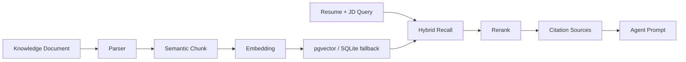

# RAG Quality

本文档说明当前项目的 RAG 质量优化方案，方便面试展示、后续扩展和开源浏览。

## 目标

RAG 在本项目中的目标不是简单“搜到文本”，而是为简历诊断和面试准备提供可引用、可解释、可评测的上下文。

核心目标：

- 提高岗位要求、八股题库、项目追问和优秀表达模板的检索命中率。
- 让 Agent 输出建议时能展示引用来源，降低幻觉风险。
- 保留无 API Key 场景下的本地可运行能力。
- 支持知识库版本和审核状态，方便后续做后台管理。

## 数据流



## Chunk 策略

实现位置：[backend/app/utils/knowledge_utils.py](../backend/app/utils/knowledge_utils.py)

当前策略：

- 先做文本规范化，统一换行和空白字符。
- 优先按标题和业务段落切分，例如岗位要求、岗位职责、项目追问、八股、优秀表达。
- 段落内按句子窗口切分，避免把一个完整问题或 bullet 截断。
- 使用 overlap 保留上下文连续性。
- 记录 `section_title`、`char_start`、`char_end`、`token_count`，方便后续引用和调试。
- 对重复 chunk 做去重，降低向量库噪声。

## Retrieval 策略

实现位置：[backend/app/services/knowledge_service.py](../backend/app/services/knowledge_service.py)

检索采用 hybrid retrieval：

1. 向量召回：优先使用 pgvector cosine similarity。
2. 关键词召回：补充精确技能词、岗位词和项目词命中。
3. 结果合并：按 `chunk_id` 去重，保留更高初始分。
4. Rerank：结合语义分、关键词覆盖、短语命中、岗位族、版本、审核状态和 section 质量排序。

无 PostgreSQL 时，SQLite 会把 embedding JSON 存在 `KnowledgeChunk.embedding` 中，用 cosine similarity 做本地 fallback。

## Rerank 策略

实现位置：[backend/app/services/rerank_service.py](../backend/app/services/rerank_service.py)

当前 rerank 特征：

- 初始检索分：向量相似度或关键词召回分。
- 关键词覆盖：query token 在 chunk 中的覆盖比例。
- 短语命中：较长短语是否直接出现在 chunk 中。
- 元数据加权：`role_family`、`version`、`published` 状态、非正文 section。
- 长度惩罚：过短或过长 chunk 降权。

输出字段：

- `retrieval_score`
- `rerank_score`
- `score`

## 引用来源

每条检索结果都会返回 `citation`：

```text
document.md | section=main | chunk=1 | version=v2
```

Agent 诊断会把 citation 注入 RAG 上下文，前端可以直接展示为“参考来源”。这能帮助用户理解建议来自岗位要求、题库、项目追问案例还是优秀表达模板。

## 知识库版本管理

文档元数据：

- `source_type`
- `tags`
- `role_family`
- `version`
- `status`
- `content_hash`

接口：

- `GET /api/knowledge/versions`
- `PATCH /api/knowledge/{doc_id}`

推荐状态流：

```text
draft -> reviewing -> published -> archived
```

当前检索默认只使用 `published` 文档，避免草稿内容污染 Agent 输出。

## 质量评测

运行：

```bash
cd backend
python tests/evaluation/run_rag_eval.py --write-report
```

输出：

- Hit@1
- Hit@K
- MRR
- Top document
- Top citation

最新报告：

- [rag_latest.md](../backend/tests/evaluation/reports/rag_latest.md)
- [rag_latest.json](../backend/tests/evaluation/reports/rag_latest.json)

当前样例集覆盖：

- AI 应用开发 RAG 项目追问
- Java 后端岗位要求
- 简历项目量化表达

## 后续优化方向

- 接入 cross-encoder rerank 或 LLM rerank，用于候选集较大时进一步提升排序质量。
- 增加 query rewrite，把 JD、简历项目和岗位族转换为更稳定的检索 query。
- 增加困难负样本，扩大 RAG eval cases。
- 在前端知识库页展示命中片段、citation、score 和版本过滤器。
- 增加离线批量评测报告趋势，观察 RAG 改动是否引入退化。
